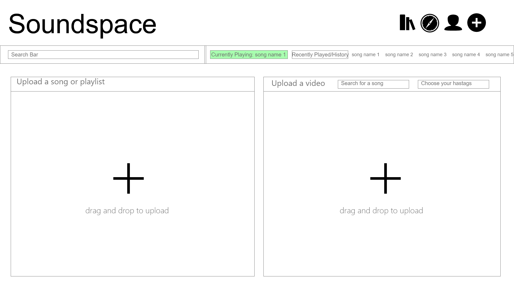
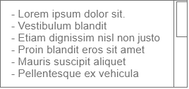
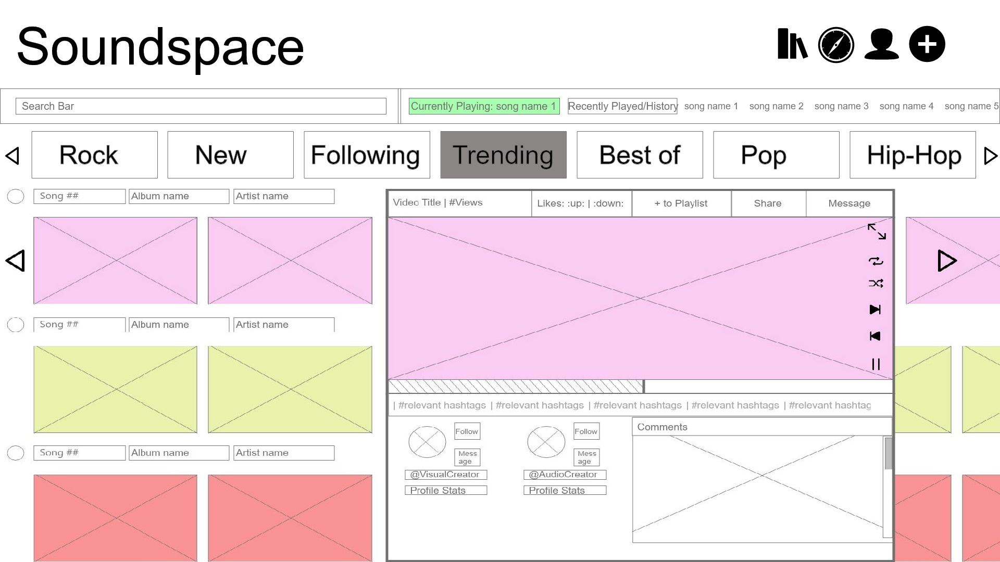
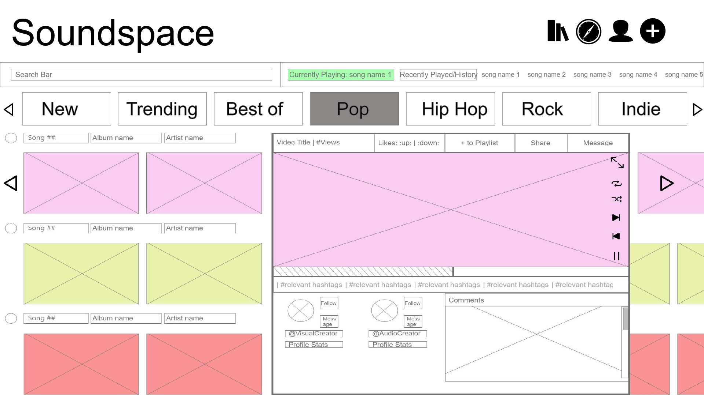

# Interaction Design

## Stream 

Based on our data collected from our research, we established three main insights to structure our wireframe design. We focused our design efforts on incorporating design features that 

* Accommodate passive use 

In our applications competitive market we found that applications that were designed to allow use whenever and wherever resulted in increased usability. Examples of this include interfaces that allow the user to stream content directly upon opening the application like Tiktok and having favorited or recently played content on the home screen of the app like Spotify. This trend is largely found to accommodate short attention spans of users and passive use. 

Based on our survey investigating situations where music is streamed, we found common answers of which included “traveling, working, and cleaning”, that indicated a trend for passive use when listening to music. Additionally, our ethnographic observations of music consumers traveling between destinations and working individually as well as socially; found that users stream content in a passive manner.

Contrary to this, our survey investigating situations where music videos are consumed, we found common answers of which included “At Home, Relaxing, and with friends”, that indicated a trend for active use. This is further supported by our ethnographic observations of visual content consumption in a coffee shop. 

Since our project aims to include both music streaming and associated visual content, we decided it was important to note the differences in how both these types of media are consumed for our designs. 

* Promote sharing and discovery between users 

In our applications competitive market we found that users of soundspace’s competitors value social media as a way to engage with others regarding music and were frustrated with the separation between social media and the music sharing experience. This aligns with the common trend that music consumers discover music in a fragmented way, typically through social media or word of mouth. Our data collected from our contextual inquiry supports this as interviewees described discovering music through recommendations from friends and family; and through personal interests. 

Based on our survey data we found that apps most used to share music or music related content included Tiktok, Youtube, Spotify, and SoundCloud. To influence our design we understood that designs common among these applications should be included in Soundspace including the location of commenting, liking, messaging, following, and hashtag features. 

* Promote engagement between artists and consumers 

In our applications competitive market, we found that users of soundspace’s competitors find listening to music a personal experience that connects them with artists, while artists find these platforms to build identity, collaborate with other artists, and gain exposure among consumers. Particularly messaging and commenting was found to be a critical feature for artist collaboration and connecting to fans. 

Our survey results found that music video consumers rarely leave comments on videos so finding ways to increase commenting was explored when creating our wireframes. 

Additionally Interviewee responses from our contextual inquiry, noted the use of social media and visual media to market and promote music and designing soundspace for the perspective of a content creator was considered 

To begin, the page serving as the central focus to our app is shown below and always appears when a user first logs into their account.

## Profile 

### Liked

### Mentions 

### Messages 

### Uploads 

## Upload 

Below is an image of our Upload page which ca be navigated to by clicking the plus icon in the navbar:

Shown above is the Upload page for our Soundspace website. On this page of the website, users would be able to upload songs or videos to songs to Soundspace. The main interaction on this page would be how when a user clicks the two big plus buttons, they will be able to upload files. For the "Upload a video" section, we added a small form where users would be able to input which song that they would like to upload. When a user clicks "Search for a song" or "Choose your hashtags" the following will appear under the box:

This is a place where the user can select which song they would like to attribute their video to. They can also add multiple hashtags to their video so that more users can find their video easier. 

We expect [personas](../requirements/personas-and-scenarios2.pdf) like Ivory Williams and Lil' Potato to use this page to upload their music, dance videos, and other content to Soundspace.

On this page there is also the navbar which follows the same convention on every page.

## Discover/Trending 

Finally, we have the Discover and Trending page which can be navigated to by clicking the compass icon in the navbar:

  

This page is focused on showing our users a variety of videos based on a filter they are searching under. For the purpose of our wireframe, a simple example of our website, we used music genres as a base filter. The first image above shows how the page would look once someone arrives at the page. The next picture is showing what the screen would look like if the user clicked the "Pop" filter. These two images together shows the interaction we want for this page.

We expect [personas](../requirements/personas-and-scenarios2.pdf) like Steven Williams to use this page often so that they can find interesting content on the go. Personas like Jeremy Jones might not use this page as much since they are looking for content that is extremely specific.

# Supplementary materials

* [Wireframes](./design/SoundSpace%20Wireframes%20.pdf)
* [Prototype](https://xd.adobe.com/view/3312afb3-c8a2-4068-8f52-79965d5bff20-6641/?fullscreen&hints=off)
