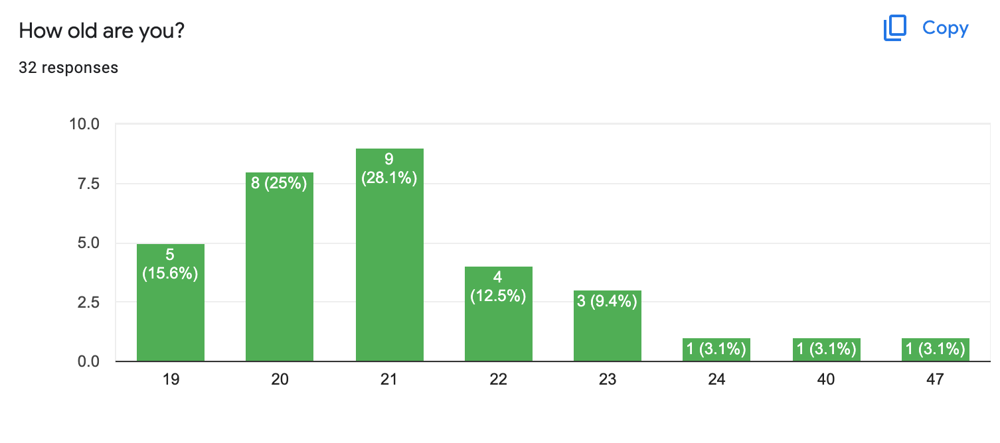
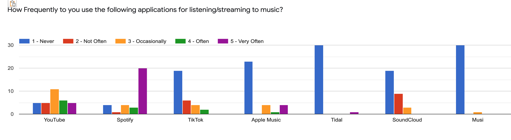
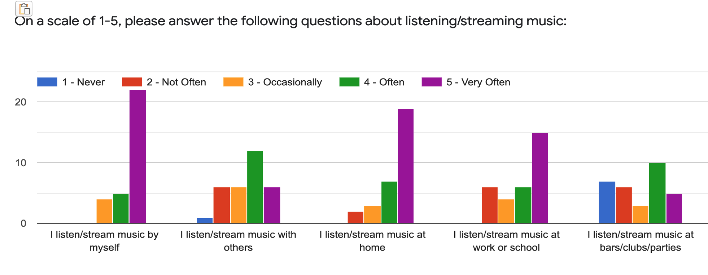
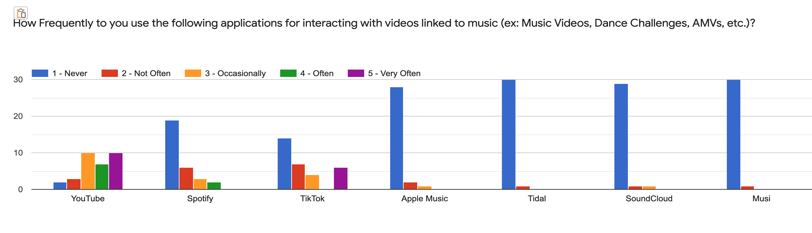
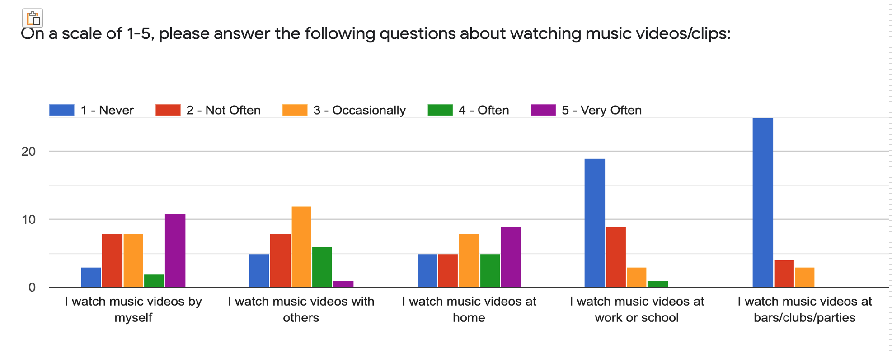
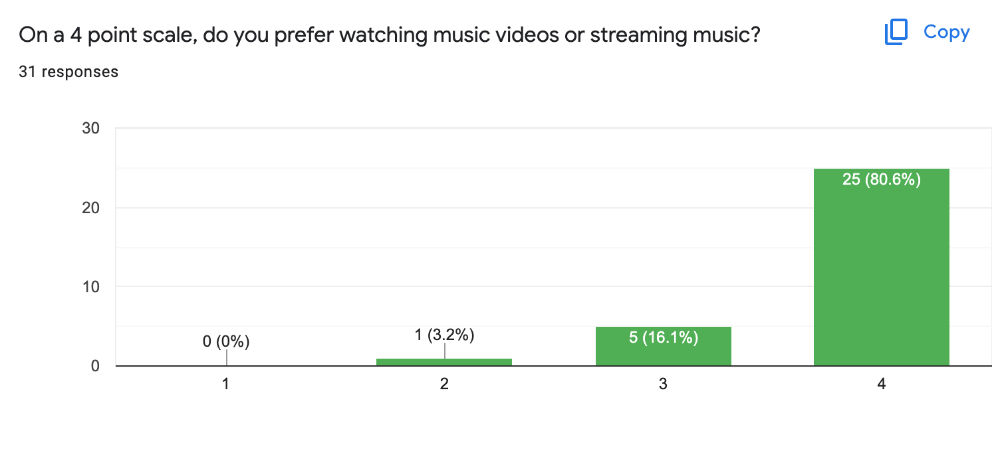
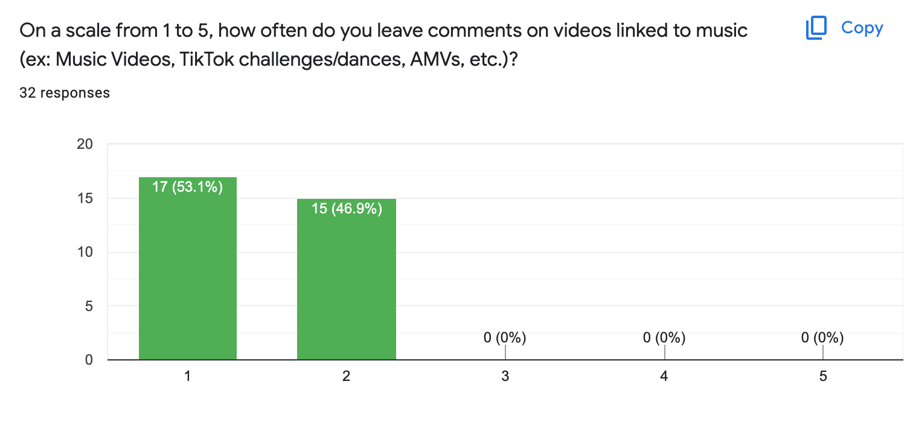
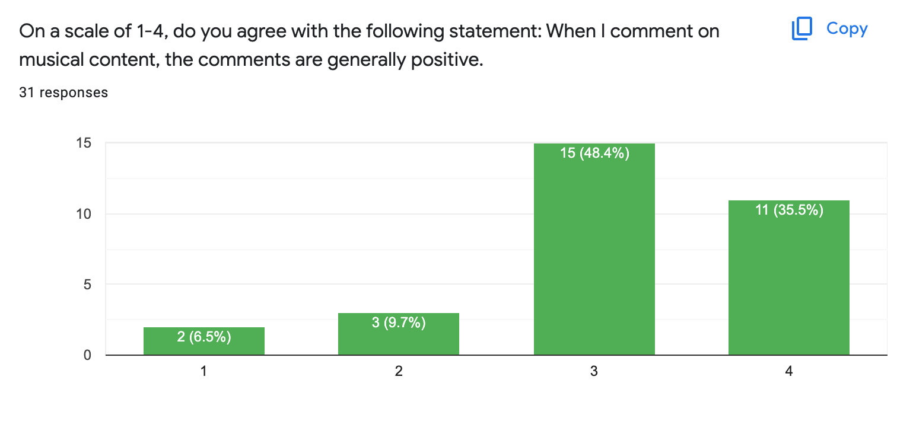
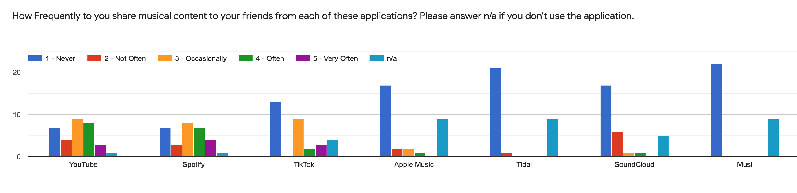

# Requirements Gathering

### Introduction:
The following report was created by [Christian Hodges](https://github.com/chodges7) and [Sufiyan Syed](https://github.com/SufiyanSyedCSUC). Our project name and team name is Sound Space and this is our **Phase I: Requirements Gathering** report.

### Methods:
- Survey: We chose to use a survey to get large sample data on music streaming and video user behavior 
	- Consisted of 32 participants answering both quantitative and qualitative questions

- Studying Documentation: Performed studying documentation to get secondary research and overall data on users/problem space
	- Short literature review of past UX studies in Music and Video streaming and Cultural data on user habits

- Contextual Inquiry: We chose to do a contextual inquiry to get qualitative data and understand the contexts where individuals listen to music and watch music videos. 
	- Consisted of 3 participants answering interview questions about music listening habits and Ethnographic observations. 

### Findings:
- Survey: 
	- "How Old are you?" 
		- 
		- Ages ranged from 19-47 with most observations ranging from 19 to 22
	- "On average, how many hours do you stream/listen to music in a day?"
		- For this question, our response ranged from 30 minutes to 12 hours in an average day. But most of the responses ranged from 4-5 hours long. (Avg. = 4.708, Med. = 3.75)
	- "What are some places or situations where you usually stream music?"
		- As expected from this type of question on a survey, each response to this question was unique to the person. Because of this here are some of the overarching places or situations where folks listened to music:
			- Driving, doing homework, at the gym, cooking, traveling, showering, and cleaning
	- "How frequently do you use the following applications for listening/streaming to music?"
		- 
		- The graph created from this response shows us how popular each of the following apps are with our participants in regards to listening to music. This graph shows that TikTok, Apple Music, Tidal, SoundCloud, and Musi are not popular among our participants and conclusions that use those applications should be taken with a grain of salt.
	- "On a scale of 1-5, please answer the following questions about listening/streaming music:"
		- 
		- This graph shows that many of our participants stream music by themselves, at home, and at work and school. Though there is a little bit of a drop off for folks who listen with others as compared to the other rows in this question.
	- "On average, how many hours do you watch music videos or clips in a day?"
		- This was an interesting question because the lowest answer we got was 0 hrs while our biggest answer was 10 hours in a day. Though that answer is certainly an outlier and the majority of our answers were under or at an hour. (Avg. = 2.179, Med. = 1)
	- "What are some places or situations where you usually watch music videos or clips?"
		- There were some answers that were similar to the last question asking about what situations would one listen/stream music, but most of the answers became similar to, "while in bed" or "at home." Some interesting answers include, "when [I] know that there is a good music video to a song maybe i’ll go find that video" and "If an artist I like releases a music video to a song I enjoy." These two responses capture the feeling that Sound Space wants to emulate.
	- "How Frequently to you use the following applications for interacting with videos linked to music (ex: Music Videos, Dance Challenges, AMVs, etc.)?"
		- 
		- This graph is intesting because it shows that folks who are looking to watch music videos will go to YouTube, Spotify, and TikTok instead of going to Apple Music, Tidal, SoundCloud, or Musi.
	- "On a scale of 1-5, please answer the following questions about watching music videos/clips:"
		- 
		- The use of this question was to see in what situations do folks watch music videos in comparison to just listening/streaming music. I think what we can gather from this chart is that folks are more likely to interact with music videos when they are alone, in small groups, and in places that are familer like home. 
	- "On a 4 point scale, do you prefer watching music videos or streaming music?"
		- 
		- The focus of this question was to get a gauge on how much users would prefer listening to music versus watching music videos. 1 in this graph is watching videos and 4 is streaming music. This question isn't the greatest in retrospect because there is a lot let barrier to entry when listening/streaming music and therefore it will be easier and more likable in general scenarios. Though, we can still gleam from this question that there is a sub-set of people who like watching music videos.
	- "On a scale from 1 to 5, how often do you leave comments on videos linked to music (ex: Music Videos, TikTok challenges/dances, AMVs, etc.)?"
		- 
		- 1 for this chart = never, 5 for this chart = very often. This chart shows us that folks generally don't leave comments on videos so this means that we should have an option for comments, but we should not make it a very large portion of our UI since it is not important to the major userbase based off of this survey.
	- "On a scale of 1-4, do you agree with the following statement: When I comment on musical content, the comments are generally positive."
		- 
		- 1 for this chart = Stronly Disagree, 4 for this chart = Strongly Agree. This shows us that when users comment on posts it is probably because they liked it so much that they wanted to show their support for the piece of content.
	- "How Frequently to you share musical content to your friends from each of these applications? Please answer n/a if you don't use the application."
		- 
		- This final chart shows us that when folks are using platforms like TikTok, YouTube, Spotify, and SoundCloud, they will probably have a piece of musical content during their use that they will share with friends. A caveat for this chart is that earlier we saw that not many of the participants in this survey used applications that weren't YouTube, Spotify, and TikTok. This means that data in the other sections could be skewed upward to have more weight, and the data for YouTube, Spotify, and TikTok might be skewed down since a lot more of the participants use those services.

### Conclusions:
Some conclusions that we can gather from the survey section of this requirements gathering phase is that watching music videos is not the most popular this in regards to music since when we asked participants about wether they liked streaming music versus watching music videos we had a clear bias towards streaming. A new user story based on this conclusion would be that the general user would like an option to stream their music with their phone screen turned off since many situations where folks interact with music include doing other tasks like working out or cleaning.

Another conclusion that we found from the survey would be that YouTube, Spotify, and TikTok are the most used applications that stream music and showcase music videos in our userbase. A user story for this conclusion is as follows: A user who uses YouTube, Spotify, and TikTok would appreciate a link to the music video on YouTube, a link to the song on Spotify, or a link to the tags used in the video on TikTok so that they can use those apps in conjunction with Sound Space.

### Caveats:
The participants in our survey were primarily rural college students living in Chico, CA. The demographics of our survey’s respondents were also largely Computer Science majors. Since a large part of our application is about creating musical content, interest in this type of application could be skewed from the participants that we surveyed. Another limitation that we found in our gathering methods was that we did not ask a lot of questions about how folks discover new music that they would like/interact with.

### Personas and Scenarios
Here is a link to the [personas and scarios](./personas-and-scenarios.pdf) pdf.

### Supplementary Materials:
[PDF of Survey](./Sound-Space-Survey.pdf)

[PDF of Contextual Enquiry Questions](./Contextual-Enquiry.pdf)

[PDF of Studying Documentation](./Studying-Documentation.pdf)
